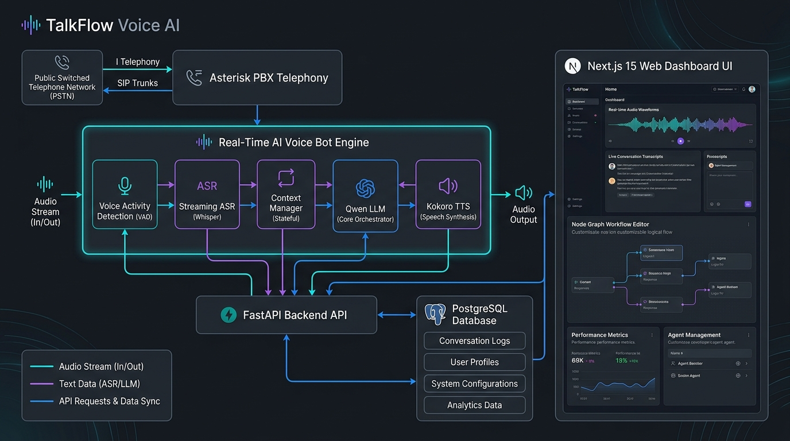

# TalkFlow: End-to-End Real-Time Voice AI Orchestration & Governance Platform

[TalkFlow](https://talkflow.ai) is an open-source, enterprise-grade AI voice orchestration and campaign governance platform built for real-time telephony, automated qualification, visual conversation script authoring, and verifier handoffs.

It’s built around three core principles:

- **Ownership** — self-host your full voice stack while keeping complete control of audio streams, telemetry, lead data, and deployment boundaries
- **Control** — choose your models, ASR/TTS providers, prompt pipelines, and campaign guardrails without vendor lock-in
- **Scale** — operate ultra-low latency real-time voice workloads with full observability, barge-in interruption handling, and production-grade reliability

TalkFlow provides both a **telephony voice bot framework** and an **operational management platform** for agencies, call centers, and enterprises building high-scale automated voice operations.

[](https://github.com/talkflow/talkflow/stargazers/)
[](https://discord.gg/talkflow)
[](https://doc.talkflow.ai)
[](LICENSE)

---

## Architecture



```
                    ┌─────────────────────────┐
                    │    Asterisk PBX / SIP   │
                    └────────────┬────────────┘
                                 │ AudioSocket (PCM Audio Stream 8kHz/16kHz)
┌────────────────────────────────▼────────────────────────────────────────┐
│                   TalkFlow AI Voice Gateway (AI Bot)                   │
│                                                                         │
│  ┌───────────────┐   ┌───────────────┐   ┌──────────────┐  ┌──────────┐ │
│  │  Silero VAD   │ ──► Faster-Whisper│ ──►  Qwen / vLLM │ ─►  Kokoro / │ │
│  │ (Voice Detect)│   │ (Streaming ASR│   │ (LLM Engine) │  │Chatterbox│ │
│  └───────────────┘   └───────────────┘   └──────────────┘  └──────────┘ │
│          │                                                      │       │
│          └──────────── Interruption / Barge-in Bus ─────────────┘       │
└────────────────────────────────┬────────────────────────────────────────┘
                                 │ REST / WebSockets / Redis Outbox Stream
┌────────────────────────────────▼────────────────────────────────────────┐
│                        TalkFlow Backend API                             │
│       (FastAPI / PostgreSQL / Redis / Outbox Event Bus / RBAC)          │
└────────────────────────────────┬────────────────────────────────────────┘
                                 │ HTTP / JSON API / WebSocket
┌────────────────────────────────▼────────────────────────────────────────┐
│                       TalkFlow Dashboard (UI)                           │
│        (Next.js 15 App Router + React 19 + Tailwind CSS + Lucide)       │
└─────────────────────────────────────────────────────────────────────────┘
```

---

## Features

- **Real-Time Voice Orchestration**  
  Stream bidirectional PCM audio with ultra-low latency over Asterisk AudioSocket with sub-second turn-taking.

- **Instant Barge-In & Interruption Handling**  
  Immediate audio buffer cancellation and speech truncation whenever the human caller interrupts the AI bot.

- **Visual Script Node Graph Editor**  
  Design non-linear conversational node graphs with custom prompts, TCPA consent capture, branch conditions, and transfer triggers.

- **Campaign & Compliance Governance**  
  All-at-once campaign start guards (script version approval, compliance profile, verifier group, and list mapping verification).

- **Lead Management & CSV Import Wizard**  
  Bulk lead ingestion with automated E.164 phone normalization, suppression list filtering, and batch tracking.

- **Verifier Handoff & QA Workspace**  
  Seamless warm transfer to licensed verifiers with audio recording playback, automated scorecards, and audit logs.

- **Full Observability & Latency Breakdowns**  
  Per-call turn tracking with VAD, ASR, LLM TTFT, and TTS latency metrics stored for performance tuning.

---

## Documentation & Guides

<https://doc.talkflow.ai>

---

## Prerequisites

- **Docker** & **Docker Compose** v2+ ([Install](https://www.docker.com/))
- **Node.js** v20.x or v22.x (for local frontend development)
- **Python** v3.13+ with **uv** (for local backend and AI bot development)
- **FFmpeg** (installed and available in system PATH)
- **8GB+ RAM** (16GB+ recommended for full local model stack)

---

## Quick Start

Get all TalkFlow core services running in 4 commands:

```bash
# 1. Clone repository
git clone https://github.com/talkflow/talkflow.git && cd talkflow

# 2. Copy environment configuration
cp .env.example .env

# 3. Start PostgreSQL, Redis, Backend API, AI Gateway, and Dashboard UI
docker compose up -d

# 4. View running services
docker compose ps
```

**Services Ready:**

- Dashboard UI: <http://localhost:3000>
- Backend REST API: <http://localhost:8000/api/v1>
- OpenAPI Documentation: <http://localhost:8000/docs>
- AI Voice Gateway (AudioSocket): `localhost:9090` (Control WS: `localhost:8001`)

**Stop services:**

```bash
docker compose down
```

---

## System Components

TalkFlow consists of three decoupled components:

### 1. Frontend Dashboard (`apps/dashboard`)
The management interface built with **Next.js 15**, **React 19**, and **Tailwind CSS**.
Provides visual script authoring, campaign management, lead import, verifier queue, audio player, and real-time call monitoring.

### 2. AI Voice Bot Engine (`services/ai-gateway`)
The real-time streaming voice orchestrator written in **Python 3.13 / AsyncIO**.
Interfaces directly with Asterisk AudioSocket, running Silero VAD, Faster-Whisper ASR, Qwen/vLLM LLM engine, Kokoro & Chatterbox TTS, and barge-in interruption handling.

### 3. Backend Governance API (`apps/backend`)
The core domain API written in **FastAPI**, **SQLAlchemy**, and **PostgreSQL**.
Manages campaigns, scripts & versioning state machines, RBAC security, lead imports, call recordings, audit logs, and outbox event streams.

---

## Local Development (Without Docker)

### 1. Set Up Infrastructure Services

Start PostgreSQL and Redis locally or via Docker:

```bash
docker run -d --name tf-postgres -p 5432:5432 -e POSTGRES_USER=talkflow -e POSTGRES_PASSWORD=admin -e POSTGRES_DB=talkflow postgres:16
docker run -d --name tf-redis -p 6379:6379 redis:7-alpine
```

### 2. Backend Governance API

```bash
cd apps/backend
uv sync
uv run alembic upgrade head
uv run uvicorn app.main:app --reload --port 8000
```

### 3. AI Voice Bot Gateway

```bash
cd services/ai-gateway
uv sync
uv run python -m app.main
```

### 4. Frontend Dashboard UI

```bash
cd apps/dashboard
npm install
npm run dev
```

---

## Running Tests

Run backend and AI Gateway test suites:

```bash
# Run backend API test suite (90+ tests)
cd apps/backend
uv run pytest

# Run AI Gateway streaming tests
cd services/ai-gateway
uv run pytest
```

---

## Troubleshooting

**Port conflict (3000, 8000, 9090):**

```bash
# Check processes on Windows PowerShell
Get-NetTCPConnection -LocalPort 3000, 8000, 9090 | Select-Object LocalPort, OwningProcess
```

**Database connection reset:**

```bash
cd apps/backend
uv run alembic upgrade head
```

---

## Security Disclosure

To report security issues related to voice streaming, audio capture, or credentials, please email <security@talkflow.ai>. Avoid posting security vulnerabilities on public GitHub issues.

---

## License

TalkFlow is open-source under the GPL-2.0 license.